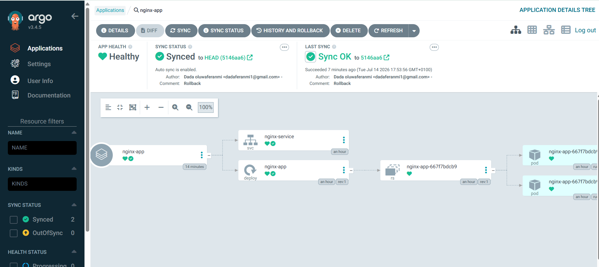
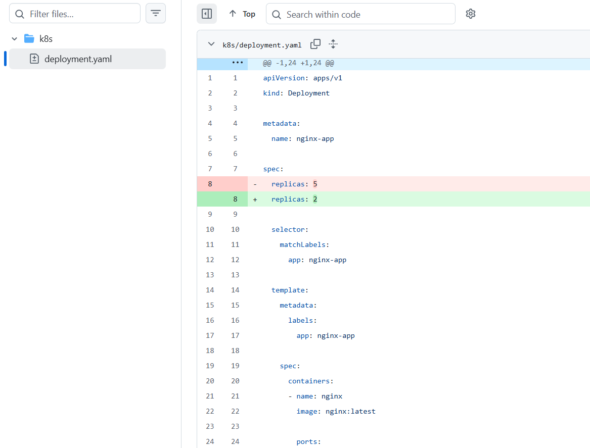
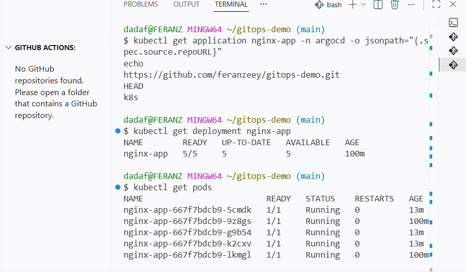
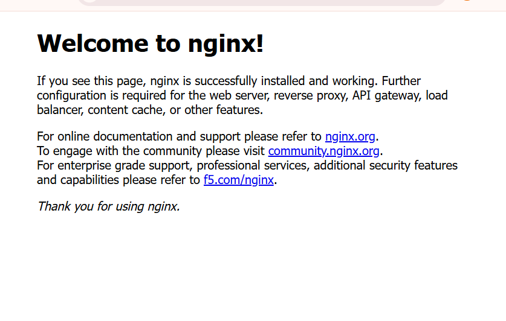

# GitOps Bootstrap with ArgoCD

A complete GitOps implementation using Kubernetes, ArgoCD, and GitHub, demonstrating automated application deployment, synchronization, and rollback.

---

## Project Overview

This project demonstrates how GitOps enables Kubernetes deployments using Git as the single source of truth.

Instead of manually applying Kubernetes manifests with `kubectl apply`, ArgoCD continuously monitors a GitHub repository and automatically synchronizes the cluster whenever changes are pushed.

The project also demonstrates Git-based rollback by reverting commits and allowing ArgoCD to restore the previous application state.

---

## Architecture

GitHub Repository
        │
        ▼
   ArgoCD watches repository
        │
        ▼
Detects Git changes automatically
        │
        ▼
Synchronizes Kubernetes cluster
        │
        ▼
NGINX Application Updated

---

## Technologies Used

- Kubernetes (Minikube)
- ArgoCD
- GitHub
- Git
- YAML
- NGINX
- kubectl

---

## Features

- GitOps deployment workflow
- Automatic synchronization
- Git as the single source of truth
- Kubernetes Deployment
- Kubernetes Service
- Git-based rollback
- Declarative infrastructure
- Version-controlled deployments

---

## Project Structure

```
gitops-demo/
│
├── k8s/
│   ├── deployment.yaml
│   └── service.yaml
│
└── README.md
```

---

## Workflow

### Step 1

Deploy ArgoCD into Kubernetes.

### Step 2

Create an ArgoCD Application connected to GitHub.

### Step 3

Enable Auto Sync.

### Step 4

Deploy the NGINX application.

### Step 5

Modify the Deployment manifest.

Example:

```yaml
replicas: 2
```

Update to

```yaml
replicas: 5
```

### Step 6

Commit and push.

```bash
git add .
git commit -m "Increase replicas"
git push origin main
```

### Step 7

ArgoCD automatically detects the Git commit and synchronizes the Kubernetes cluster.

No manual deployment commands are required.

---

## Rollback Demonstration

Rollback is performed by reverting the deployment manifest.

```yaml
replicas: 5
```

Back to

```yaml
replicas: 2
```

Commit:

```bash
git add .
git commit -m "Rollback deployment"
git push origin main
```

ArgoCD automatically restores the previous deployment state.

---

## Verification Commands

Check deployment

```bash
kubectl get deployment nginx-app
```

Check pods

```bash
kubectl get pods
```

Check services

```bash
kubectl get svc
```

Verify ArgoCD Application

```bash
kubectl get application nginx-app -n argocd
```

---

## Screenshots

### ArgoCD Application


---

### Application Details



---

### GitHub Commit



---

### Kubernetes Deployment



---

### NGINX Running



---

## Key Achievements

- Successfully configured ArgoCD
- Connected GitHub repository
- Implemented Auto Sync
- Demonstrated GitOps workflow
- Automated Kubernetes deployments
- Implemented Git-based rollback
- Verified cluster synchronization
- Eliminated manual deployments

---

## Skills Demonstrated

- GitOps
- Kubernetes
- ArgoCD
- GitHub
- YAML
- Linux
- Container Orchestration
- Infrastructure Automation
- Continuous Delivery
- DevOps Best Practices

---

## Future Improvements

- Deploy to Amazon EKS
- Integrate GitHub Actions
- Build Docker CI pipeline
- Add Helm Charts
- Add Prometheus Monitoring
- Add Grafana Dashboards
- Deploy multiple microservices
- Implement Canary Deployments

---

## Author

**Oluwaferanmi Dada**

DevOps Engineer

GitHub:
https://github.com/feranzeey